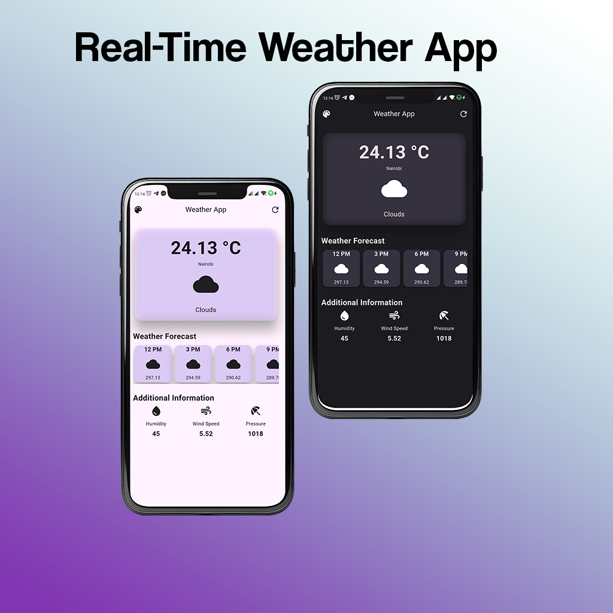
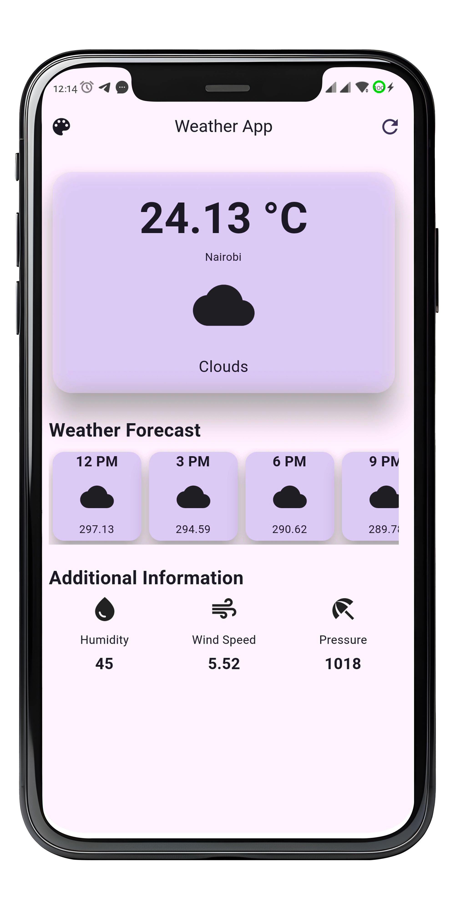
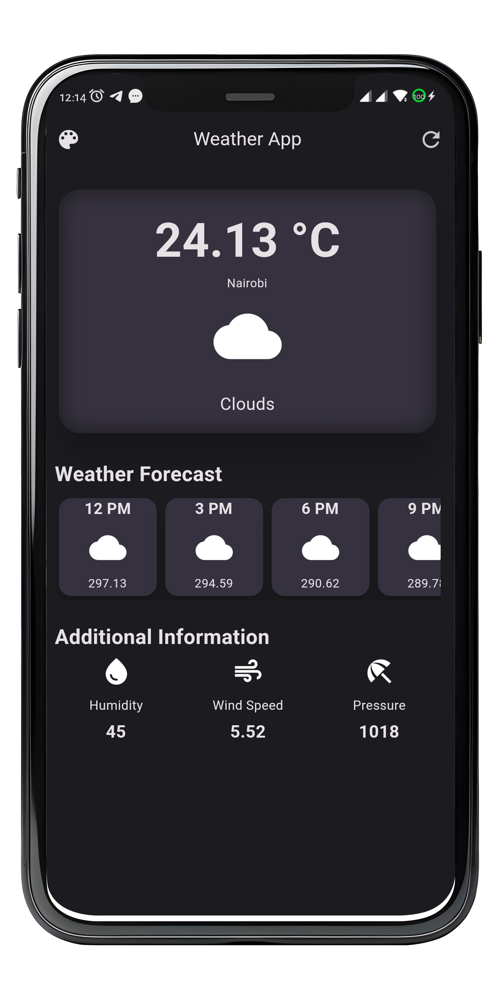

# WeatherApp
# Overview
Weather App is a mobile application built with Flutter that provides users with real-time weather information. With a clean and intuitive interface, users can easily access current weather conditions and forecasts for different locations.

Features
Current Weather: View the current temperature, weather conditions, and humidity for your selected location.

Forecast: Get a 7-day weather forecast, including daily highs and lows, to plan ahead.

Location-based Weather: Automatically fetches weather information based on the user's current location.

Custom Locations: Add and save multiple locations to track weather conditions in different places.

Screenshots

